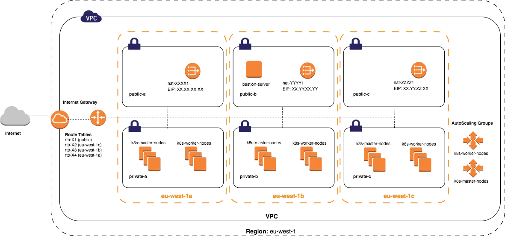

# devops - use cases
This is a repository with the purpose of creating a scalable platform to handle large number of concurrent requests. 
As an answer to this assessement it was designed an unique solution to attend HA and bootstrap a kubernetes cluster  with basic monitoring and logging.

Working actively with aws I will be implementing the solution using this platform. Because we need to have a self managed infrastructure I decided to go with a hybrid solution, using kops to create a terraform module with all the required components. 
Even tought that it is possible to run kops directly, it was preferable to create terraform resources to implement the pattern IAAC.

Due to the lack of time some of the mentioned components cannot be implemented

## Architecture
### Infra-structure requirements:
- The infrastructure should be redundant running on multiple availiability zones
- It should scale vertically, if the number of workers goes above a pre determined threshold autoscaller should kick in and create additional ec2 instances
- Additionally critical applications should enable horizonal pod autoscaling
- Security, best practices need to be implemented to protect aws accounts and created resources,

As an additional requirement the kubernetes api endpoint needs to be exposed publicly, while this can be implemented with proper zone segregation between public and private due to time constraints I opted by just use kops to create a public available endpoint

Normally an aws account needs to be harden to protect the platform itself and the ec2 instances where kubernetes is running, this can be done with the following steps:
- Implement network segmentation
- Use security groups
- Implement Network Access Control Lists (NACLs)
- Implement VPN or Direct Connect
- Use private subnets
- Use AWS WAF
- Use AWS GuardDuty
- Use AWS Security Hub
- Implement encryption
- Implement monitoring

Since we need to have an high available cluster we need to setup the resources for ec2 autoscalling
HA:
- Create an Auto Scaling Group (ASG)
- Create a Launch Configuration
- Set up Scaling Policies
- Set up Notifications

### Infrastructure High level architecture


### kubernetes cluster requirements
- Ha cluster with 3 master nodes (defined on kops)
- basic monitoring (kube-prometheus)
- basic logging (eck stack)
- storage provisioner (Amazon EBS CSI)

Cluster components:
- flux/argocd
- logging (eck)
- monitoring (prometheus)
- ingress-controller, on our case ALB operator
- Platform secrets, tipically hashicorp vault
- network-policies should be put on place to only allow communication
- gatekeeper for security harden
- service mesh, like linkerd
- backups, e.g. velero

Usually OIDC is configured to restrict access to the cluster
### CI/CD
- Implement a test application being deployed into the cluster.

Usually I would favour a gitops solution for this issue, howeve due to the lack of time resources were installed using terraform helm_release. With an appropriate timeframe we could deploy flux or argocd to take care of the deployment of all cluster services required for its correct configuration.

Github:
- Implement CODEOWNERS to define who can review changes to be merged
- Enable pre-commit checks for litting and basic code verifications
- Create a batch of smoke tests to be run on pull request creation or update
- Enable branch protections with minimum approvals for merging
- Create github actions to trigger CI builds and release

Argocd/flux:
- Configure the application helm release
- Configure image updater on dev environments to redeploy the latest application image automatically
- Trigger automatic PR creation for next environments on pipeline to deploy latest release approved on previous environment
- On production enable cannary deployments or red/green deployments to allow easy rollbacks

security:
- github should be harden to restrict access to repositories


## Prerequisites

Before you begin, make sure you have the following:

    An AWS account with sufficient permissions to create resources
    AWS CLI installed and configured
    Kops installed
    kubectl installed

Usage

To create a Kubernetes cluster using Kops on aws, follow these steps:

Create Cluster configuration
```
kops create cluster \
    --state s3://sergio-kops \
    --node-count 3 \
    --node-size=t2.medium \
    --zones us-east-1a,us-east-1b,us-east-1c \
    --master-zones us-east-1a,us-east-1b,us-east-1c \
    --out=./k8s/kops \
    --target=terraform \
    --networking calico \
    public-k8s.henriques.live 
```
    
This will create a terraform module inside the directory k8s/kops

This repository has 2 stacks, k8s and services
k8s - creates the whole aws infrastructure and deploys kubernetes
services - deploy required services on the kubernetes cluster

    terraform init
    terraform plan
    terraform apply

These commands will use Terraform to create the necessary infrastructure in AWS (e.g. VPC, subnets, kubernetes cluster, etc.)

Once the cluster is created, you can use kubectl to interact with it. For example, you can run kubectl get nodes to see the worker nodes that were created.
Cleaning Up

To delete the Kubernetes cluster and all associated resources, run the following command:

terraform destroy

